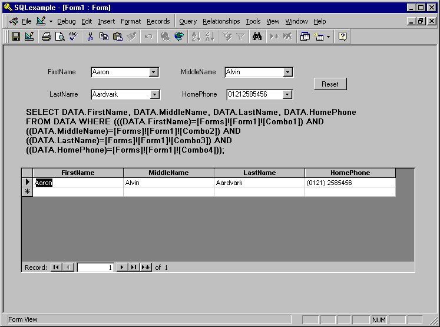

## SQL Generator for MS Access

### Description

Absolutely tip top code for MS Access users. This does exactly what it says on the box.

This has got to be worth a vote or two.

Merry Christmas folks.
 
### More Info
 

             |
---                |---
**Submitted On**   |2001-12-20 14:50:58
**By**             |[Phil Grossman](https://github.com/Planet-Source-Code/PSCIndex/blob/master/ByAuthor/phil-grossman.md)
**Level**          |Advanced
**User Rating**    |4.0 (32 globes from 8 users)
**Compatibility**  |VBA MS Access
**Category**       |[Microsoft Office Apps/VBA](https://github.com/Planet-Source-Code/PSCIndex/blob/master/ByCategory/microsoft-office-apps-vba__1-42.md)
**World**          |[Visual Basic](https://github.com/Planet-Source-Code/PSCIndex/blob/master/ByWorld/visual-basic.md)
**Archive File**   |[SQL\_Genera4322312202001\.zip](https://github.com/Planet-Source-Code/phil-grossman-sql-generator-for-ms-access__1-29980/archive/master.zip)

